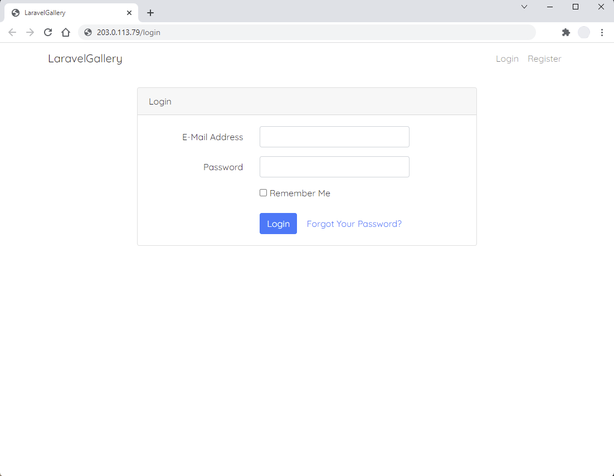

# ☸ DigitalOcean Kubernetes deployment

## 👀 Overview

This deployment uses [_Terraform_](https://www.terraform.io/) to provision several key cloud infrastructure resources on the DigitalOcean cloud platform (Kubernetes cluster, database cluster, object storage service).

Terraform also bootstraps the Kubernetes cluster with [_Flux_](https://fluxcd.io/), and configures this GitHub repository by committing the [_GitOps Toolkit_](https://fluxcd.io/docs/components/) components for _Flux_ to version control, and creating & adding an SSH deploy key that the cluster will use for Flux reconciliation. Once _Flux_ is installed, it will take over and deploy workloads defined in the source repository (see [Features](#features)). The _Sealed Secrets_ infrastructure component must be available before encrypted secrets needed by other components (_cert-manager_, _ExternalDNS_, the end application configuration) can be used.

This repository represents the configured state of a live system, deployed at https://ebi-gallery-do.iangrant.me [^1] You can deploy the application yourself using this codebase by forking the repository, and modifying the deployment & configuration parameters appropriately.[^2] See the workflow in [🚚 Usage](#-usage), below.

[^1]: The live system has been deployed for the purposes of demonstrating the technical challenge; it will be shut down after February 14, 2002.
[^2]: At the time of writing, DigitalOcean offer a [$100 free credit, 60-day trial](https://www.digitalocean.com/?refcode=56ab1cd93fe6). Alternatively, you could adapt the code to another cloud provider.

### Features

  - DigitalOcean managed Kubernetes cluster, configured with an auto-scaling node pool and to automatically upgrade
  - DigitalOcean managed MySQL database cluster, configured to auto-upgrade
  - DigitalOcean Spaces (S3-compatible) object storage service bucket, for storing and serving images uploaded via the application (configured with an appropriate CORS rule to allow it to serve public objects)
  - All provisioned cloud resources are assigned to a new DigitalOcean project for grouping and easy overview
  - [_Flux_](https://fluxcd.io/) CD Controllers, which enable a GitOps-style workflow where the state of the K8s cluster is continuously reconciled against that declared by definitions in a version control source repository. _Flux_ is used to deploy:
    - [_Ingress NGINX_](https://kubernetes.github.io/ingress-nginx/) Controller, which seamlessly integrates with the DigitalOcean Cloud Controller to automatically provision an external DigitalOcean load balancer resource, and attach it to the K8s cluster
    - [_cert-manager_](https://cert-manager.io/) Certificate Controller, which automates TLS certificate issue & renewal for K8s Ingress workloads (configured to use the [_Let's Encrypt_](https://letsencrypt.org/) ACME service and [_Cloudflare_ DNS](https://www.cloudflare.com/en-gb/dns/) provider)
    - [_ExternalDNS_](https://github.com/kubernetes-sigs/external-dns) Controller, which synchronizes external DNS provider records (configured for Cloudflare) to K8s Ingress workloads
    - [_Sealed Secrets_](https://github.com/bitnami-labs/sealed-secrets) Controller, which enables K8s Secrets to be stored in version control and used in GitOps workflows by managing their encryption lifecycle
    - The application itself, as Kubernetes Deployment, Service and Ingress workloads, with a K8s ConfigMap and Secret that defines the application environment (configuring it to use the managed MySQL database and Spaces S3 endpoint as the filesystem driver). Updates to the application deployment are triggered by committing changes to the [definitions](flux/app/) in the repository.
  - Application is consequently served over HTTPS, via DNS hostname record automatically configured at Cloudflare, and public IP address exposed by the DigitalOcean load balancer. Images uploaded via the application are stored in, and served directly from, a DigitalOcean Spaces S3 HTTPS endpoint.

[](https://www.digitalocean.com/?refcode=56ab1cd93fe6&utm_campaign=Referral_Invite&utm_medium=Referral_Program&utm_source=badge)

## 🚚 Usage

### 🧰 Requirements

  - A [DigitalOcean account](https://www.digitalocean.com/?refcode=56ab1cd93fe6)
  - A [personal access token](https://docs.digitalocean.com/reference/api/create-personal-access-token/) for the DigitalOcean API
  - An [access key](https://www.digitalocean.com/community/tutorials/how-to-create-a-digitalocean-space-and-api-key#creating-an-access-key) for DigitalOcean Spaces
  - A domain name — you could use [Freenom](https://www.freenom.com/en/index.html?lang=en) for a free, temporary domain name
  - A [Cloudflare account](https://dash.cloudflare.com/sign-up), with your domain as a hosted DNS zone, and an [API token](https://developers.cloudflare.com/api/tokens/create), with `Zone:Read` and `DNS:Edit` permissions (for all zones, or the zone you will use, as desired)
  - A [GitHub](https://github.com/) account, with a [personal access token](https://docs.github.com/en/authentication/keeping-your-account-and-data-secure/creating-a-personal-access-token), scoped to include the `repo` permissions ("full control of private repositories")
  - (optional) A [Terraform Cloud](https://cloud.hashicorp.com/products/terraform) [account](https://learn.hashicorp.com/tutorials/terraform/cloud-sign-up?in=terraform/cloud-get-started)
  - [git](https://git-scm.com/) (`>=2.8.0` recommended) [installed](https://git-scm.com/book/en/v2/Getting-Started-Installing-Git) on your computer
  - (optional) [GitHub CLI (`gh`)](https://cli.github.com/) (`>=2.3.0` recommended) [installed](https://github.com/cli/cli#installation) on your computer
  - [terraform](https://www.terraform.io/) `>=1.1.0` [installed](https://learn.hashicorp.com/tutorials/terraform/install-cli?in=terraform/aws-get-started) on your computer
  - [DigitalOcean CLI (`doctl`)](https://docs.digitalocean.com/reference/doctl/) (`>=1.70.0` recommended) [installed](https://docs.digitalocean.com/reference/doctl/how-to/install/) on your computer
  - [kubectl](https://kubernetes.io/docs/reference/kubectl/overview/) `>=1.21` (`>=1.21.9, <1.22` recommended) [installed](https://kubernetes.io/docs/tasks/tools/install-kubectl-linux/#install-using-native-package-management) on your computer
  - (optional) [flux2 CLI (`flux`)](https://fluxcd.io/docs/cmd/)[^3] (`>=v0.26` recommended) [installed](https://fluxcd.io/docs/installation/#install-the-flux-cli) on your computer
  - [kubeseal](https://github.com/bitnami-labs/sealed-secrets/releases) (`>=v0.17` recommended) [installed](https://github.com/bitnami-labs/sealed-secrets#installation) on your computer

[^3]: The `flux` CLI tool can be useful for inspecting Flux logs during reconciliation.

### 🚀 Workflow

This step-by-step workflow guides you through creating the DigitalOcean infrastructure and Kubernetes components from scratch. You could combine most of the Flux components to accelerate the deployment, or for redeployment.

🔔 The following example shows sample values for sensitive or specific parameters; substitute your own configuration accordingly.

1. #### Configure your DigitalOcean credentials

    Use `doctl` to configure your local environment with your DigitalOcean personal access token:

    ```shell
    $ doctl auth init
    Please authenticate doctl for use with your DigitalOcean account. You can generate a token in the control panel at https://cloud.digitalocean.com/account/api/tokens

    Enter your access token:
    Validating token... OK
    ````

2. #### Fork and clone this repository

    You can either fork the repository from the GitHub.com web UI, or you can use the GitHub CLI, `gh`:

    ```shell
    $ gh auth login --web
    ! First copy your one-time code: XXXX-XXXX
    - Press Enter to open github.com in your browser...
    ✓ Authentication complete. Press Enter to continue...

    ✓ Logged in as imgrant
    $ gh repo fork https://github.com/imgrant/ebi-gallery-infra.git --clone
    Cloning into 'ebi-gallery-infra'...
    remote: Enumerating objects: 462, done.
    remote: Counting objects: 100% (462/462), done.
    remote: Compressing objects: 100% (300/300), done.
    remote: Total 462 (delta 188), reused 387 (delta 130), pack-reused 0
    Receiving objects: 100% (462/462), 1.80 MiB | 657.00 KiB/s, done.
    Resolving deltas: 100% (188/188), done.
    Updating upstream
    From https://github.com/imgrant/ebi-gallery-infra
     * [new branch]      doks-flux-deployment -> upstream/doks-flux-deployment
     * [new branch]      main                 -> upstream/main
    ✓ Cloned fork
    ```

    💡 The remainder of this tutorial assumes you're working in your forked clone of the repository. Unless otherwise clear, you can assume all filenames and paths shown are **relative to the `do-k8s-flux` subdirectory.**

3. #### Clean the existing configuration

    Because this repository currently reflects the state of live, configured system, the K8s definitions in the `flux/` directory will not be appropriate to any new system that you deploy.

    Prepare the configuration for a fresh deployment on new infrastructure by renaming the `flux/` directory, e.g. to `flux.example/`.
    Commit the change to your forked repository. If you push the changes to a different (new) branch, make a note of the branch name.[^4]
    
    [^4]:  You'll configure Flux to watch a specific directory in your repo for changes to your K8s cluster, by default that directory is named `flux`. An alternative would be to adjust the input variable in Terraform to instruct Flux to use a different location for reconciliation.

4. #### Create a Terraform Cloud organization and workspace

    In this example, we're using Terraform Cloud as a remote backend store for the Terraform state. You can omit this step if you don't want to do that, or use an existing organization and/or workspace in your Terraform Cloud account as you wish.

      > To create a new organization: https://www.terraform.io/cloud-docs/users-teams-organizations/organizations#creating-organizations

      > To create a new workspace: https://www.terraform.io/cloud-docs/workspaces/creating
    
    The default [execution mode](https://www.terraform.io/cloud-docs/workspaces/settings#execution-mode) for new workspaces is "Remote"—change this to "Local" in order for Terraform to perform runs from your computer.

5. #### Configure Terraform to use the Cloud provider

    To use your Terraform Cloud workspace as the remote backend store for the state file, create `terraform/cloud.tf`, using `terraform/cloud.tf.sample` as a template.

    Use the `terraform` CLI to [login](https://www.terraform.io/cli/commands/login) to Terraform Cloud:

    ```shell
    $ terraform login
    Terraform will request an API token for app.terraform.io using your browser.

    If login is successful, Terraform will store the token in plain text in
    the following file for use by subsequent commands:
        /home/ebi-user/.terraform.d/credentials.tfrc.json

    Do you want to proceed?
      Only 'yes' will be accepted to confirm.

      Enter a value: yes


    ---------------------------------------------------------------------------------

    Terraform must now open a web browser to the tokens page for app.terraform.io.

    If a browser does not open this automatically, open the following URL to proceed:
        https://app.terraform.io/app/settings/tokens?source=terraform-login


    ---------------------------------------------------------------------------------

    Generate a token using your browser, and copy-paste it into this prompt.

    Terraform will store the token in plain text in the following file
    for use by subsequent commands:
        /home/ebi-user/.terraform.d/credentials.tfrc.json

    Token for app.terraform.io:
      Enter a value: 


    Retrieved token for user ebi-user


    ---------------------------------------------------------------------------------

                                              -                                
                                              -----                           -
                                              ---------                      --
                                              ---------  -                -----
                                              ---------  ------        -------
                                                -------  ---------  ----------
                                                    ----  ---------- ----------
                                                      --  ---------- ----------
      Welcome to Terraform Cloud!                     -  ---------- -------
                                                          ---  ----- ---
      Documentation: terraform.io/docs/cloud             --------   -
                                                          ----------
                                                          ----------
                                                          ---------
                                                              -----
                                                                  -


      New to TFC? Follow these steps to instantly apply an example configuration:

      $ git clone https://github.com/hashicorp/tfc-getting-started.git
      $ cd tfc-getting-started
      $ scripts/setup.sh
   ```

6. #### Define required input variables for Terraform

    Create `terraform/input.auto.tfvars` by copying `terraform/example.tfvars` and populating with your DigitalOcean API token, DigitalOcean Spaces access key ID and secret, GitHub personal access token, and owner of your repository (i.e. your GitHub username, or organization, as applicable).

7. #### Prepare the Terraform environment

    ```shell
    $ cd ebi-gallery-infra/do-k8s-flux/terraform
    $ terraform init
    Initializing modules...
    - db-cluster in db-cluster
    - doks-cluster in doks-cluster
    - k8s-config in k8s-config

    Initializing Terraform Cloud...

    Initializing provider plugins...
    - Finding hashicorp/kubernetes versions matching ">= 2.7.0"...
    - Finding hashicorp/helm versions matching ">= 2.4.0"...
    - Finding gavinbunney/kubectl versions matching ">= 1.10.0"...
    - Finding fluxcd/flux versions matching ">= 0.0.13"...
    - Finding hashicorp/tls versions matching "3.1.0"...
    - Finding digitalocean/digitalocean versions matching ">= 2.16.0"...
    - Finding integrations/github versions matching ">= 4.5.2"...
    - Installing hashicorp/helm v2.4.1...
    - Installed hashicorp/helm v2.4.1 (signed by HashiCorp)
    - Installing gavinbunney/kubectl v1.13.1...
    - Installed gavinbunney/kubectl v1.13.1 (self-signed, key ID AD64217B5ADD572F)
    - Installing fluxcd/flux v0.10.1...
    - Installed fluxcd/flux v0.10.1 (self-signed, key ID D5D3316A880BB5B9)
    - Installing hashicorp/tls v3.1.0...
    - Installed hashicorp/tls v3.1.0 (signed by HashiCorp)
    - Installing digitalocean/digitalocean v2.17.1...
    - Installed digitalocean/digitalocean v2.17.1 (signed by a HashiCorp partner, key ID F82037E524B9C0E8)
    - Installing integrations/github v4.20.0...
    - Installed integrations/github v4.20.0 (signed by a HashiCorp partner, key ID 38027F80D7FD5FB2)
    - Installing hashicorp/kubernetes v2.7.1...
    - Installed hashicorp/kubernetes v2.7.1 (signed by HashiCorp)

    Partner and community providers are signed by their developers.
    If you'd like to know more about provider signing, you can read about it here:
    https://www.terraform.io/docs/cli/plugins/signing.html

    Terraform has created a lock file .terraform.lock.hcl to record the provider
    selections it made above. Include this file in your version control repository
    so that Terraform can guarantee to make the same selections by default when
    you run "terraform init" in the future.

    Terraform Cloud has been successfully initialized!

    You may now begin working with Terraform Cloud. Try running "terraform plan" to
    see any changes that are required for your infrastructure.

    If you ever set or change modules or Terraform Settings, run "terraform init"
    again to reinitialize your working directory.
    ```

8. #### Apply the Terraform plan to create the cloud infrastructure

    You can use `terraform plan` to preview what Terraform would do before actually applying the plan. When satisfied, use `terraform apply` to kick off the infrastructue provisioning:

    ```shell
    $ terraform apply

    Terraform used the selected providers to generate the following execution plan. Resource actions are indicated with the following symbols:
      + create
     <= read (data resources)

    Terraform will perform the following actions:

    <... a lot of long output is shown, illustrating what Terraform will do and the outputs it will generate ...>

    Do you want to perform these actions?
      Terraform will perform the actions described above.
      Only 'yes' will be accepted to approve.

      Enter a value: 
    ```

    Type `yes` to proceed with applying the Terraform plan. The outputs will be displayed when run is complete.

    During the process, Terraform will install Flux in your Kubernetes cluster, and commit the manifests to your GitHub repository. It will also add a deploy key to the repo (and install the private key in the cluster).

    💡 Creating the Kubernetes cluster and database cluster on DigitalOcean will take some time (typically up to 10 minutes).

9. #### Verify the Kubernetes cluster state

    Use `doctl` to fetch the kubeconfig for your cluster, and use `kubectl` to check the cluster is working:

    ```shell
    $ doctl kubernetes cluster kubeconfig save k8s-ebi-gallery
    Notice: Adding cluster credentials to kubeconfig file found in "/home/ebi-user/.kube/config"
    Notice: Setting current-context to do-lon1-k8s-ebi-gallery
    $ kubectl cluster-info
    Kubernetes control plane is running at https://00000000-0000-0000-0000-000000000000.ondigitalocean.com
    CoreDNS is running at https://00000000-0000-0000-0000-000000000000.k8s.ondigitalocean.com/api/v1/namespaces/kube-system/services/kube-dns:dns/proxy

    To further debug and diagnose cluster problems, use 'kubectl cluster-info dump'.
    ```

10. #### Deploy supporting infrastructure: namespaces

    Create namespaces in your Kubernetes cluster with Flux by copying the following YAML files back into the `do-k8s-flux/flux/infrastructure` directory in your repository:

      - `ingress-ns.yaml`
      - `external-dns-ns.yaml`
      - `cert-manager-ns.yaml`

    Commit and push the changes, and allow a few minutes for Flux to reconcile the changes.
    You can check the namespaces were successfully created with `kubectl`:

    ```shell
    $ kubectl get namespaces
    NAME              STATUS   AGE
    cert-manager      Active   21h
    default           Active   23h
    external-dns      Active   21h
    flux-system       Active   23h
    ingress-system    Active   22h
    kube-node-lease   Active   23h
    kube-public       Active   23h
    kube-system       Active   23h
    ```

11. #### Deploy supporting infrastructure: Helm repositories

    Add the Helm repositories to your Kubernetes cluster with Flux by copying the following YAML files back into the `do-k8s-flux/flux/infrastructure` directory in your repository:

      - `bitnami-helm-repo.yaml`
      - `ingress-helm-repo.yaml`
      - `sealed-secrets-helm-repo.yaml`
      - `jetstack-helm-repo.yaml`

    Commit and push the changes, and allow a few minutes for Flux to reconcile the changes.
    You can check the repositories were successfully installed with `kubectl`:

    ```shell
    $ kubectl get helmrepo --namespace flux-system
    NAME             URL                                             READY   STATUS                                                                               AGE
    bitnami          https://charts.bitnami.com/bitnami              True    Fetched revision: f045a2765586b4cc1d9ed87c6db480f54a37e3369b172cb3c799e3786d4caffb   21h
    ingress-nginx    https://kubernetes.github.io/ingress-nginx      True    Fetched revision: 8e21f1fcaa20216f34ac41528404d47c6a6b63921bb546cc1c44b69889a1c28d   22h
    jetstack         https://charts.jetstack.io                      True    Fetched revision: 31e11e56dcf71b3f2da695ec58d7a60f7ed3762bcd9152865bb7ed803d0b39c3   21h
    sealed-secrets   https://bitnami-labs.github.io/sealed-secrets   True    Fetched revision: 87d0a27ea7f6a483a096e603d3dd0787c348d777634144771b6f68aec056a970   21h
    ```

12. #### Deploy supporting infrastructure: Ingress NGINX

    Create the Ingress NGINX Controller in your cluster with Flux by copying the following YAML file back into the `do-k8s-flux/flux/infrastructure` directory inyour repository:

      - `ingress-helm-release.yaml`

    Commit and push the changes, and allow a few minutes for Flux to reconcile the changes.
    You can check the controller was successfully installed with `kubectl`:

    ```shell
    $ kubectl get all --namespace ingress-system
    NAME                                           READY   STATUS    RESTARTS   AGE
    pod/ingress-nginx-controller-f67f85fc4-pl54z   1/1     Running   0          4h50m

    NAME                                         TYPE           CLUSTER-IP      EXTERNAL-IP      PORT(S)                      AGE
    service/ingress-nginx-controller             LoadBalancer   10.245.103.30   203.0.113.79   80:30386/TCP,443:30053/TCP   22h
    service/ingress-nginx-controller-admission   ClusterIP      10.245.56.45    <none>           443/TCP                      22h

    NAME                                       READY   UP-TO-DATE   AVAILABLE   AGE
    deployment.apps/ingress-nginx-controller   1/1     1            1           22h

    NAME                                                 DESIRED   CURRENT   READY   AGE
    replicaset.apps/ingress-nginx-controller-54bfb9bb    0         0         0       22h
    replicaset.apps/ingress-nginx-controller-f67f85fc4   1         1         1       4h50m
    ```

    💡 You can also verify the Ingress Controller deployment was successful by going to the DigitalOcean cloud dashboard and confirming that a new load balancer has been deployed (named according to the annotation in `flux/infrastructure/ingress-helm-release.yaml`) and attached to your Kubernetes cluster.

13. #### Deploy supporting infrastructure: Sealed Secrets

    Create the Sealed Secrets Controller in your cluster with Flux by copying the following YAML file back into the `do-k8s-flux/flux/infrastructure` directory inyour repository:

      - `sealed-secrets-helm-release.yaml`

    Commit and push the changes, and allow a few minutes for Flux to reconcile the changes.
    You can check the controller was successfully installed with `kubectl`:

    ```shell
    kubectl get deployment sealed-secrets-controller  --namespace kube-system
    NAME                        READY   UP-TO-DATE   AVAILABLE   AGE
    sealed-secrets-controller   1/1     1            1           21h
    ```

14. #### Create and apply Sealed Secrets

    Use `kubeseal` to fetch the current Sealed Secrets certificate from your cluster:

    ```shell
    $ cd do-k8s-flux/flux/infrastructure
    $ kubeseal --fetch-cert >sealed-secrets.pem
    ```

    Use `kubectl` to create a Kubernetes Secret template for cert-manager that defines your Cloudflare API token:

    ```shell
    $ kubectl create secret generic cloudflare-api-token --from-literal=api-token='<Your Cloudflare API token>' --dry-run=client -o yaml -n cert-manager > cert-manager-cloudflare-api-token.yaml
    ```
    
    Then use `kubeseal` to convert the plaintext Secret manifest into a Sealed Secret:

    ```shell
    $ kubeseal --cert sealed-secrets.pem --format=yaml < cert-manager-cloudflare-api-token.yaml > cert-manager-cf-apitoken-secret.yaml
    ```

    ⚠️ Remove the plaintext secret file **before you commit** to version control:

    ```shell
    $ shred -u cert-manager-cloudflare-api-token.yaml
    ```

    Repeat the process for ExternalDNS, which also needs a Cloudflare API token (you could optionally use separate Cloudflare tokens for cert-manager and ExternalDNS):

    ```shell
    $ kubectl create secret generic cloudflare-api-token --from-literal=cloudflare_api_token='<Your Cloudflare API token>' --dry-run=client -o yaml -n external-dns > external-dns-cloudflare-api-token.yaml
    $ kubeseal --cert sealed-secrets.pem --format=yaml < external-dns-cloudflare-api-token.yaml > external-dns-cf-apitoken-secret.yaml
    $ shred -u external-dns-cloudflare-api-token.yaml
    ```

    Commit and push the changes, and allow a few minutes for Flux to reconcile the changes.
    You can check the secrets were successfully deployed and unsealed with `kubectl` (e.g. for cert-manager):

    ```shell
    kubectl get secret cloudflare-api-token --namespace cert-manager
    NAME                   TYPE     DATA   AGE
    cloudflare-api-token   Opaque   1      21h
    ```

15. #### Deploy supporting infrastructure: cert-manager

    Install cert-manager in your cluster with Flux by copying the following YAML file back into the `do-k8s-flux/flux/infrastructure` directory inyour repository:

      - `cert-manager-helm-release.yaml`

    Commit and push the changes, and allow a few minutes for Flux to reconcile the changes.
    You can check the Helm release was successfully applied with `kubectl`:

    ```shell
    kubectl get helmrelease cert-manager -n cert-manager
    NAME           READY   STATUS                             AGE
    cert-manager   True    Release reconciliation succeeded   18h
    ```

16. #### Create cert-manager certificate Issuers

    Create a ClusterIssuer resource in your Kubernetes cluster, which will be used to issue Let's Encrypt TLS certificates for your Ingress workloads, by copying the following YAML file back into the `do-k8s-flux/flux/infrastructure` directory inyour repository:

      - `cert-manager-clusterissuer-letsencrypt-cloudflare.yaml`
    
    ❗ You will need to edit the manifest first, to change the domain (`dnsZone`) and email address.

    Commit and push the changes, and allow a few minutes for Flux to reconcile the changes.
    You can check the Issuer resource was successfully created with `kubectl`:

    ```shell
    kubectl get clusterissuer letsencrypt-staging-cloudflare
    NAME                             READY   AGE
    letsencrypt-staging-cloudflare   True    18h
    ```

17. #### Deploy supporting infrastructure: ExternalDNS

    Install ExternalDNS in your cluster with Flux by copying the following YAML file back into the `do-k8s-flux/flux/infrastructure` directory inyour repository:

      - `external-dns-helm-release.yaml`

    ❗ You will need to edit the manifest first, to change the `domainFilters` to reflect your domain.

    Commit and push the changes, and allow a few minutes for Flux to reconcile the changes.
    You can check ExternalDNS was successfully installed with `kubectl`:

    ```shell
    kubectl get all -n external-dns
    NAME                                READY   STATUS    RESTARTS   AGE
    pod/external-dns-6cb65b8f45-lwj7d   1/1     Running   8          20h

    NAME                   TYPE        CLUSTER-IP      EXTERNAL-IP   PORT(S)    AGE
    service/external-dns   ClusterIP   10.245.134.51   <none>        7979/TCP   21h

    NAME                           READY   UP-TO-DATE   AVAILABLE   AGE
    deployment.apps/external-dns   1/1     1            1           21h

    NAME                                      DESIRED   CURRENT   READY   AGE
    replicaset.apps/external-dns-6cb65b8f45   1         1         1       20h
    replicaset.apps/external-dns-76658bbc75   0         0         0       21h
    ```

19. #### Deploy the application

    Copy the following application YAML manifests back into the `do-k8s-flux/flux/app` directory inyour repository:

      - `env-config.yaml`
      - `env-secret.yaml.template`
      - `backend.yaml`
      - `frontend.yaml`
    
    Edit `env-config.yaml` and `env-secret.yaml.template` to include your own parameters. Use `kubeseal` to convert the secret template into a Sealed Secret (removing the plaintext file afterwards, before committing to version control):

    ```shell
    $ cd do-k8s-flux/flux/app
    $ kubeseal --cert ../infrastructure/sealed-secrets.pem --format=yaml < app/env-secret.yaml.template > env-secret-config.yaml
    $ shred -u env-secret.yaml.template
    ```

    Edit the Ingress resource definition in `frontend.yaml` to use your desired hostname under your domain in the `spec:` portion.

    Commit and push the changes, and allow a few minutes for Flux to reconcile the changes.

20. #### 🥳 Go to the application URL and use the interface to browse and upload images

    The application should be available at the desired URL you configured, e.g. https://ebi-gallery-do.iangrant.me

    

    See the [application source code repository](https://github.com/imgrant/LaravelGallery) for more information on the app itself and how to use it.

    💡 The application uses [Laravel's built-in authentication controllers](https://laravel.com/docs/5.6/authentication), you can use the 'Register' function to create a user account (need not be a real email address) in order to access the app.[^5]

[^5]: Since this is a demo application, email functionality is not configured or enabled via the deployment. The password reset feature does not function.

21. #### 🍵 When you're done, tear down the infrastructure resources using Terraform

    ```shell
    $ cd ../terraform
    $ terraform destroy

    <... a large mount of output scrolls as Terraform refreshes the known vs actual state of your infrastructure ...>

    Terraform used the selected providers to generate the following execution plan. Resource actions are indicated with the following symbols:
      - destroy

    Terraform will perform the following actions:

    <... a large amount of output is shown, indicating what Terraform will destroy ...>

    Plan: 0 to add, 0 to change, 42 to destroy.

    Do you really want to destroy all resources?
      Terraform will destroy all your managed infrastructure, as shown above.
      There is no undo. Only 'yes' will be accepted to confirm.

      Enter a value: yes
    
    <... a large amount of output is shown as Terraform performs the planned operations ...>

    Destroy complete! Resources: 42 destroyed.
    ```
